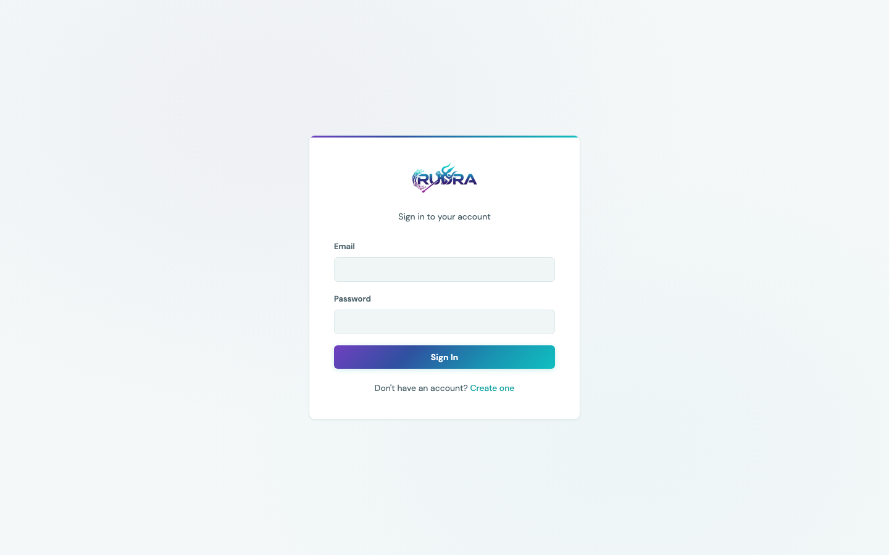
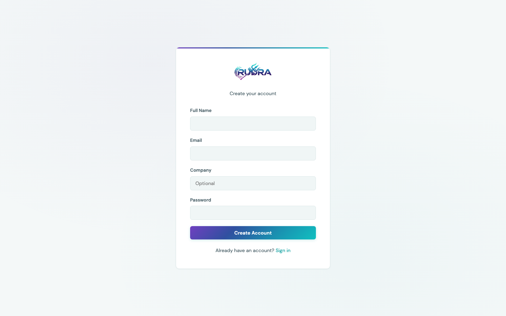
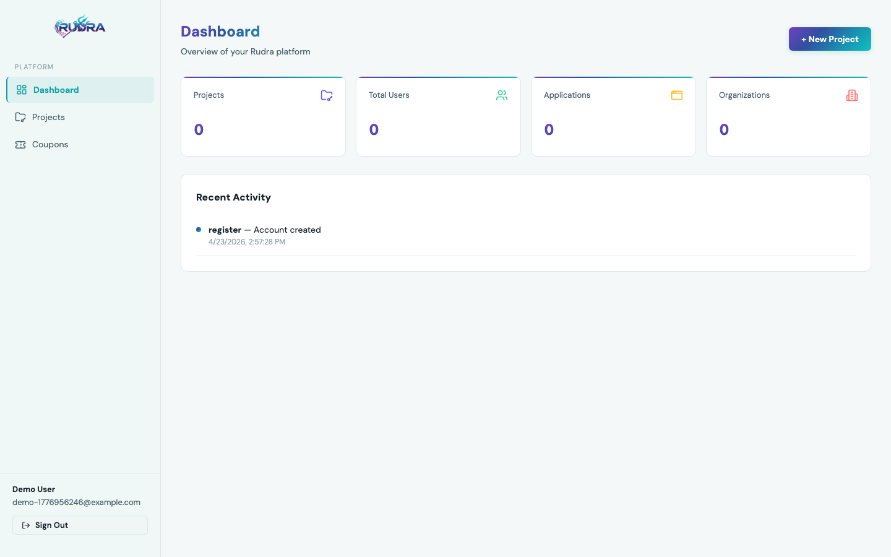
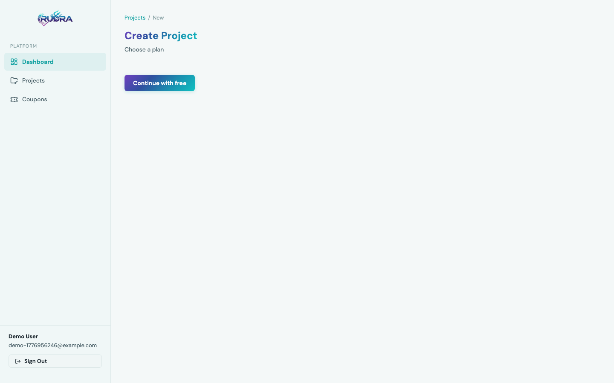
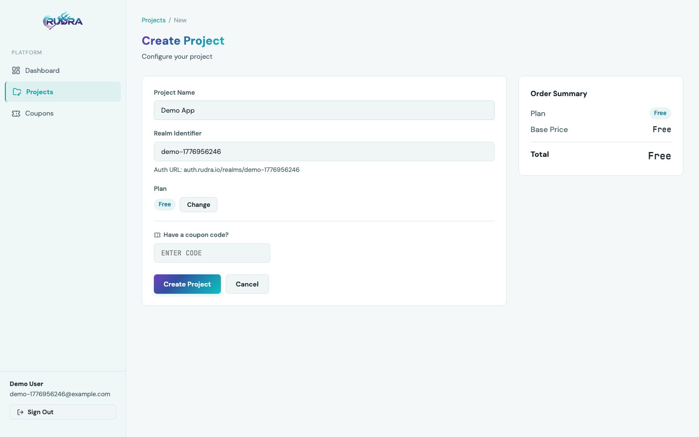
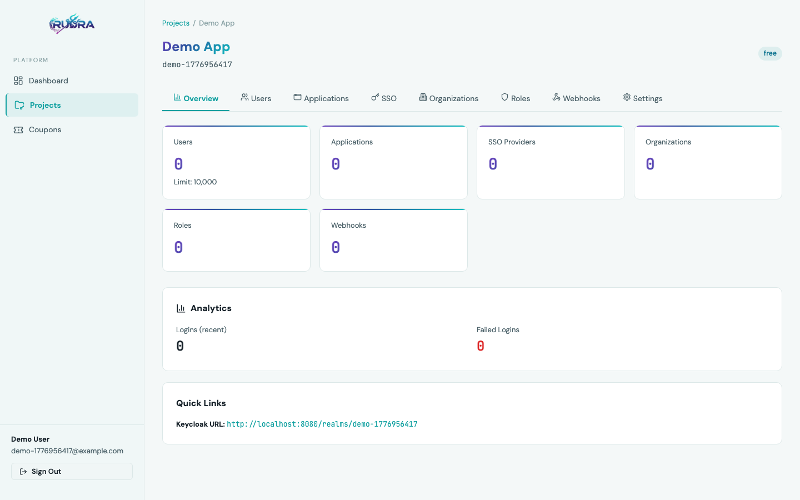
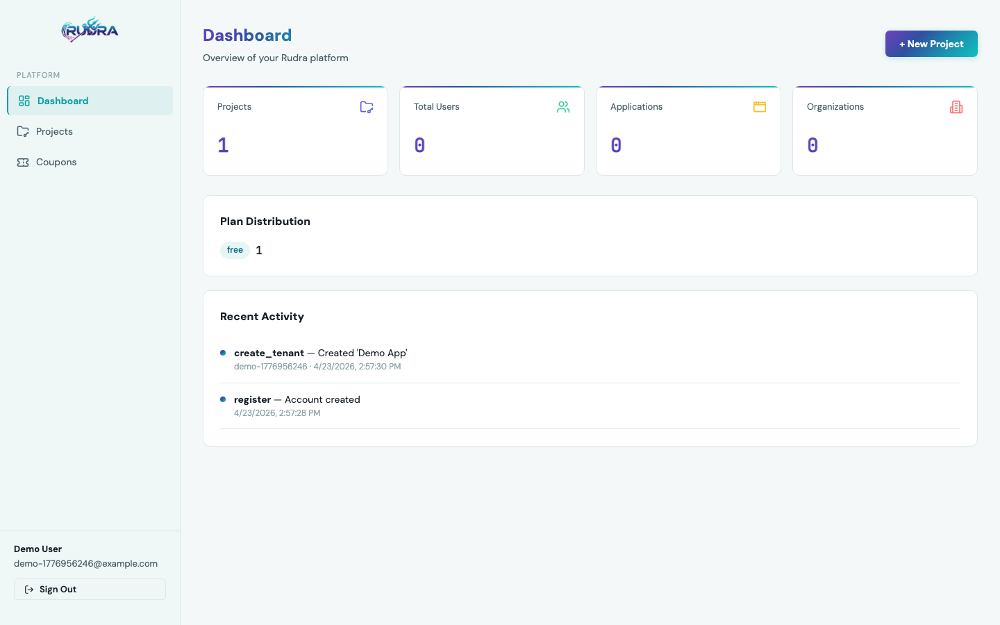

# Product tour

A walkthrough of the Rudra dashboard captured against a clean
`docker compose up` against commit on `dev`. Every shot is 1440x900.

## 1. Sign in

The dashboard is a React SPA served by nginx on port 3000. Unauthenticated
traffic is redirected to `/login`.

## 2. Create an admin account

Registration hits `POST /api/auth/register` on the FastAPI backend, which
hashes the password with PBKDF2-SHA256 (260k iterations) before persisting
the record in MongoDB, then returns a 24 hour JWT.

## 3. Empty dashboard

Immediately after sign up there are no projects, users, applications or
organizations. The activity feed records the account creation event.

## 4. Pick a plan

Projects are plan scoped. The free tier caps users, projects and
organizations; the Pro, Business and Enterprise tiers unlock SAML,
webhooks, analytics, impersonation and breach detection. Plan data comes
from `GET /api/plans`.

## 5. Configure the project

Pick a human name and a realm identifier (used as the Keycloak realm
slug). A coupon code can be attached here to apply a discount on the base
plan.

## 6. Project detail

`POST /api/tenants` creates the Keycloak realm and the Mongo tenant row
in a single transaction. The project detail page surfaces eight tabs
(Overview, Users, Applications, SSO, Organizations, Roles, Webhooks,
Settings), live user and login counts from Keycloak events, and the
direct Keycloak URL for the realm.

## 7. Populated dashboard

Back on the global dashboard the stats roll up across every project the
admin owns. Plan distribution, per project headcount and recent activity
are computed by the backend from MongoDB and Keycloak admin events.
